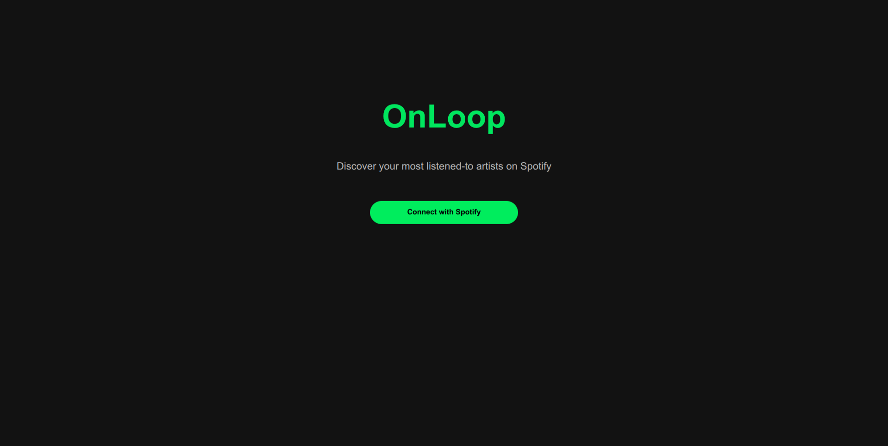
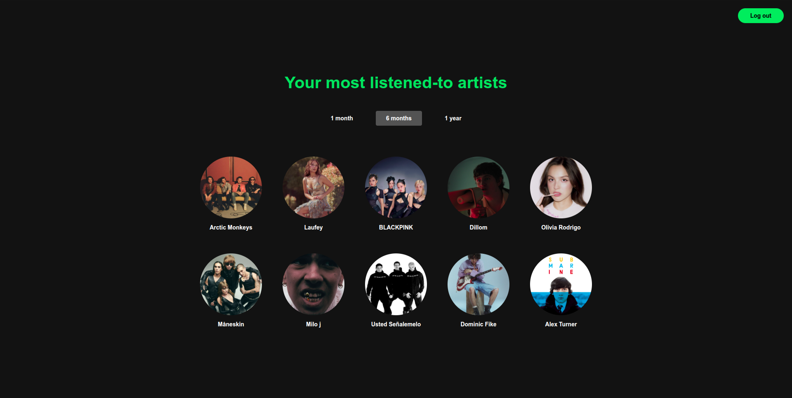

# OnLoop

 **A web app that shows your top 10 most-listened-to Spotify artists**

 [Deploy](DEPLOY.md) · [Spanish](README.md)

### **Preview**






> [!WARNING]
> Due to Spotify's current API policies, the application runs in development mode, restricting access to a  limited group of test users. 
> The project is fully deployed and functional at [onloop.com.ar](https://onloop.com.ar). If you would like to test it with your own account, feel free to request access via [LinkedIn](https://www.linkedin.com/in/valentina-sancho).


[**View Desktop version** ](https://github.com/user-attachments/assets/5fba26f6-1e14-45ed-9658-38746b87a784)

[**View Mobile version** ](https://github.com/user-attachments/assets/d9ca8cee-03e1-4cfe-8a21-9b5e0072e408)


---

### About the project

 The project integrates the Spotify API to display a user's most-listened-to artists over different time ranges.

OnLoop was my first hands-on approach to backend web development, where I learned and implemented:

- The HTTP protocol and client-server architecture
- OAuth 2.0 and secure authorization flows
- Session management with HttpOnly cookies and CSRF protection
- Application deployment on AWS EC2 with Docker
- NoSQL databases with AWS DynamoDB
- Encryption of sensitive tokens at rest using Fernet

### Tech Stack

| Layer | Technology |
|-------|------------|
| Backend | FastAPI (Python) |
| Database | AWS DynamoDB |
| Infrastructure | AWS EC2 + Docker |
| Authentication | OAuth 2.0 (Spotify) |
| Security | Fernet encryption, HttpOnly cookies, CSRF state validation |
| Frontend | HTML, CSS, JavaScript (Vanilla) |

### Architecture

```
Browser → FastAPI (EC2) → Spotify API
                ↓
            DynamoDB
```

**Authentication flow:**
1. User clicks "Login"
2. Backend generates a random `state`, stores it in an HttpOnly cookie, and redirects to Spotify
3. Spotify redirects back to the backend with a `code` and the same `state`
4. Backend validates that the `state` matches (CSRF protection), exchanges the `code` for tokens, and creates a session in DynamoDB
5. Tokens are encrypted with Fernet before being stored

**Session management:**
- Sessions have a 14-day TTL from the last refresh
- If Spotify returns a 401, the frontend detects the expired token and automatically calls `/refresh`
- If the refresh fails, the user is redirected to login

### Project structure

```
OnLoop/
├── backend/
│   ├── routers/
│   │   ├── auth.py         # /login, /callback, /logout, /refresh
│   │   ├── api.py          # /api/top-artists
│   │   └── pages.py        # /, /top-artists
│   ├── services/
│   │   ├── db.py           # DynamoDB
│   │   ├── sessions.py     # session management
│   │   └── spotify.py      # Spotify API integration
│   ├── config.py
│   ├── main.py
│   └── utils.py            # encryption
├── frontend/
│   ├── pages/
│   │   ├── login/
│   │   │   ├── login.html
│   │   │   └── login.js
│   │   └── top-artists/
│   │       ├── top-artists.html
│   │       └── top-artists.js
│   └── styles.css
├── tests/
│   ├── integration/
│   │   └── test_sessions.py
│   ├── test_callback.py
│   ├── test_login.py
│   ├── test_logout.py
│   ├── test_refresh.py
│   └── test_top_artists.py
├── docker-compose.yml
├── Dockerfile
└── README.md
```

### Endpoints

#### `GET /login`

Initiates the OAuth 2.0 authentication flow with Spotify.

**Response:** Redirects the user to the Spotify authorization page.

**Cookies set:**

| Cookie | Description |
|--------|-------------|
| `oauth_state` | Random token for CSRF protection. HttpOnly, Secure. |

---

#### `GET /callback`

OAuth flow callback endpoint. Spotify redirects here with the authorization code.

**Query params:**

| Parameter | Type | Description |
|-----------|------|-------------|
| `code` | string | Spotify authorization code |
| `state` | string | State for CSRF validation |
| `error` | string | Error returned by Spotify (optional) |

**Responses:**

| Case | Redirect |
|------|----------|
| Success | `/top-artists` + `session_id` cookie set |
| Spotify error | `/?r=error` |
| No `code` | `/?r=error` |
| Invalid `state` | `/?r=error` |
| Failed to get tokens | `/?r=error` |
| Failed to create session | `/?r=error` |

**Cookies set on success:**

| Cookie | Description |
|--------|-------------|
| `session_id` | Session identifier. HttpOnly, Secure. |

---

#### `GET /api/top-artists`

Returns the authenticated user's top 10 most-listened-to artists.

**Requires cookie:** `session_id`

**Query params:**

| Parameter | Type | Default | Possible values |
|-----------|------|---------|-----------------|
| `time_range` | string | `short_term` | `short_term`, `medium_term`, `long_term` |

**Successful response `200`:**

```json
[
  {
    "name": "Artist name",
    "image": "https://image-url.com/photo.jpg"
  }
]
```

**Error responses `200`:**

| Error | Description |
|-------|-------------|
| `{"error": "NO_SESSION"}` | No `session_id` cookie or session does not exist |
| `{"error": "SESSION_EXPIRED"}` | Access token was rejected by Spotify (401) |
| `{"error": "FAILED_TO_FETCH_ARTISTS"}` | Error communicating with Spotify |

---

#### `POST /refresh`

Renews the access token using the refresh token stored in the session.

**Requires cookie:** `session_id`

**Successful response `200`:**

```json
{ "ok": true }
```

**Error responses `200`:**

| Error | Description |
|-------|-------------|
| `{"error": "NO_SESSION"}` | No `session_id` cookie or no associated refresh token |
| `{"error": "FAILED_TO_REFRESH"}` | Spotify rejected the refresh token or DynamoDB update failed |

---

#### `GET /logout`

Deletes the user's session and clears the `session_id` cookie.

**Requires cookie:** `session_id`

**Responses:**

| Case | Redirect |
|------|----------|
| Success | `/` + `session_id` cookie deleted |
| No `session_id` | `/?r=error` |
| Failed to delete session | `/?r=error` |

---

### Query parameters in redirects

When the frontend receives a redirect with `?r=`, it displays a toast with the corresponding message:

| Value | Message |
|-------|---------|
| `no_session` | "Please log in" |
| `session_expired` | "Your session has expired, please log in again" |
| `fetch_error` | "Could not load your artists, please try again" |
| `error` | "Something went wrong, please try again" |


---

*Made by [valensancho](https://github.com/valensancho)*